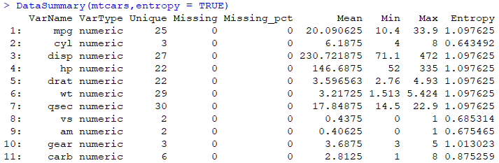

# DataMan

[](https://travis-ci.org/SixiangHu/DataMan) [](http://www.gnu.org/licenses/gpl-2.0.html)

R package for data cleaning, preliminary data analysis and modeling assessing with visualisation.

### Data Cleaning

Data cleaning have 2 functions at the moment:

* `DetMiss` : Detecting missing value in a given data frame, data.table or vector.

* `PopMiss` : Imputing missing values via: deleting, replace, or populating with mean or mode.

### Preliminary Data Analysis

* `DataSummary`: Enhanced data summary of a dataset given min, max, missing, unique count and variable type info.


* `CramersV`: Calculate the Cramers' V statistics on character or factor variables in a given dataset.

* `dataPlot`: Plot response on an one-way basis by explanatory variable.
```{r}
library(MASS)
data("Insurance")
dataPlot(Insurance$Age,Insurance$Claims,exposure = Insurance$Holders,
         by=Insurance$District,xname="Age",byname="District")
```


* `dataComp`: Compare two dataset to check whether there is a profile change.

### Model Assess

* `compPlot`: Compare model prediction with actual on one-way basis.

* `liftPlot`: Visualising and comparing model accuracy by lift curves.

* `resiPlot`: Assessing the residual using contour and AvsE chart.
```{r}
Pred = Insurance$Claims + runif(nrow(Insurance),min=0,max=10)
resiPlot(Insurance$Claims,Pred)
```


* `rocPlot`:  Comparing model predictions under roc curve (AUC).

* `interPlot`: Visualising data feature or model predictions by 2 factors at the same time using 3D plot.
```{r}
interPlot(Insurance$Age,Insurance$District,Insurance$Claims,xname="Age",yname="District")
```


* `modelMetric`: Gives simple model metrics calculation functions.

* `tree2data`: function used to collect information from `gbm` or `randomForest` model object to create data for `sankeyNetwork` plot in `networkD3` package. Example:

```{r}
library(networkD3)
data(iris)
iris.mod <- gbm(Species ~ ., distribution="multinomial", data=iris, n.trees=2000, shrinkage=0.01, cv.folds=5, verbose=FALSE, n.cores=1)
tree_data <- tree2data(iris.mod,1)
sankeyNetwork(tree_data[[1]],tree_data[[2]],Source="src",Target="tar",Value="value",NodeID="name")
```

### Getting Started

You can install `DataMan` from GitHub as follows:

```r
devtools::install_github('SixiangHu/DataMan')
```

### License

This package is free and open source software, licensed under [GPL 2 or later](http://opensource.org/licenses/gpl-license).
